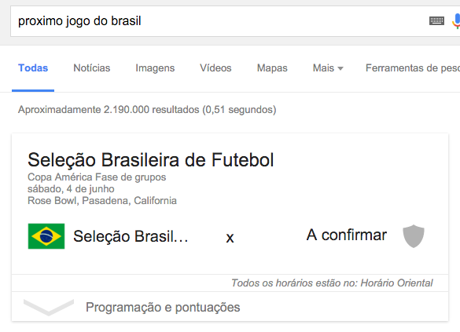

# What's that?
It's just a simple website that retrieves the first upcoming game of the Brazilian
soccer team.

# Why?
Well, as a hopeful Brazilian, I still follow our soccer team dreaming of better days.

Often me and my friends come up with this question (it turned out an inside joke).
We realized that it's not as easy as it should be to get the answer,
even Google tricks us!

# How?
This is a Meteor app, but for now it's running only on the client side. The
data is fetched from an Amazon Lambda function via GET request. The client side
is just React with a little bit of ES6 (I am still learning it).

# Roadmap
- Show more upcoming games
- Optimize lambda function (probably try to use a database or something)
